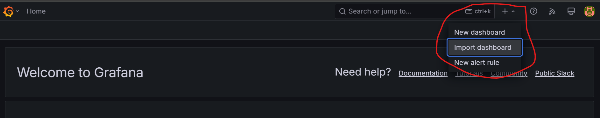

# Kubernetes installation and monitoring

Prerequisite for OAI 5G - ORAN Installation on Kubernetes
Tested on Ubuntu 22.04.5 LTS, k8s version 1.30.5-1.1

## Prepare scripts
```
sudo chmod +x install_k8s.sh install_docker.sh
```

## 1. Install docker and k8s
```
bash install_docker.sh
bash install_k8s.sh
```

Notes: taint master node if you do not have worker nodes
```
 kubectl taint nodes <node-name> node-role.kubernetes.io/control-plane-
```

## 2. Prometheus
```
kubectl create namespace monitoring

kubectl create -f clusterRole.yaml
kubectl create -f config-map.yaml
kubectl create  -f prometheus-deployment.yaml

kubectl create -f prometheus-service.yaml --namespace=monitoring

kubectl apply -f kube-state-metrics-configs/

# check pods and deployments

kubectl get pods -n monitoring
kubectl get deployments -n monitoring
kubectl get deployments kube-state-metrics -n kube-system
```

## 3. Grafana
```
kubectl create -f grafana-datasource-config.yaml
kubectl create -f deployment.yaml
kubectl create -f service.yaml

# port forward without printing to terminal

nohup kubectl port-forward -n monitoring <grafana-pod-name> 3000 2>&1 &
```

## 4. Access Grafana
```
http://localhost:3000
user: admin
password: admin
```

## 5. Import dashboard to Grafana WebUI:
use `KubernetesPodsMonitoringViaPrometheus.json`


## 6. Multus CNI
```
git clone https://github.com/k8snetworkplumbingwg/multus-cni.git ~/multus-cni
cat ~/multus-cni/deployments/multus-daemonset-thick.yml | kubectl apply -f -
```

### 7. OAI Namespace
```
kubectl create ns oai
```

